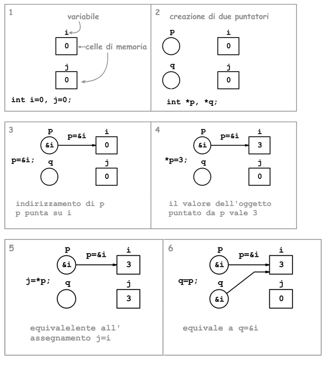

# Puntatori in C++

## Cos'è un puntatore?

Un puntatore è una variabile che contiene l'**indirizzo di memoria** di un'altra variabile. In altre parole, invece di contenere un valore diretto, il puntatore "punta" a un indirizzo dove è memorizzato un valore.

## Motivazioni

Nel linguaggio C++ la gestione della memoria è manuale e diretta, a differenza di linguaggi più ad alto livello (python, java) che si occupano automaticamente di gestirla. Questo significa che il programmatore ha il controllo completo su come e dove i dati vengono memorizzati. 

Grazie ai puntatori, è possibile gestire grandi quantità di dati senza copiarli, solamente riferendosi all'indirizzo di memoria giusto. Questo si rivela molto utile soprattutto nel caso in cui ci troviamo a programmare ambienti dove le risorse sono scarse, come un microcontrollore con memoria limitata.


## Sintassi base
Nel seguente esempio viene istanziata la variabile intera x con valore 10 e un puntatore p, il quale "punta" all'indirizzo della variabile x.
```cpp
int x = 10;
int* p = &x;  // p è un puntatore a un intero, che contiene l'indirizzo di x
```

- `int* p` dichiara `p` come puntatore a un intero.
- `&x` restituisce l'indirizzo di `x`.
- `p` ora contiene l'indirizzo di `x`.

### Usare il valore puntato

Per accedere o modificare il valore a cui punta un puntatore, si usa l'operatore `*`:

```cpp
cout << x << endl;   // Stampa 10
cout << *p << endl;  // Stampa ancora 10
```

Utilizzare invece il puntatore senza `*`, significa riferirsi al suo indirizzo di memoria

```cpp
cout << p << endl;  // Stampa l'indirizzo di memoria a cui il puntatore si riferisce
cout << *p  << endl;   // Stampa il valore presente all'indirizzo di memoria a cui il puntatore si riferisce
```

### Considerazioni
Dal momento che la variabile p, "punta" allo stesso indirizzo di memoria della variabile x, **modificare uno dei due valori modificherà anche l'altro**.
Le due variabili sono quindi legate insieme.

```cpp
int x = 10;
int* p = &x;  // p è un puntatore a un intero, che contiene l'indirizzo di x

x = 20; // modifico il valore di x

cout << x << endl;   // Stampa 20
cout << *p << endl;  // Stampa ancora 20, è stato modificato anche questo valore
```

### Esempio visuale



## Puntatori e struct

E' possibile definire un puntatore verso una struct. In questo caso, per accedere ai membri della struct, è necessario utilizzare una sintassi del tipo `(*ptr).x`, in quanto prima dobbiamo riferirci al valore della struct, e poi al campo specifico. Per facilitare l'utilizzo delle struct, è possibile utilizzare l'operatore `->`, come riportato nell'esempio sotto.

Ad esempio, supponiamo di avere una struct semplice:

```cpp
struct Punto {
    int x;
    int y;
};

int main() {
    Punto p = {10, 20};
    Punto* ptr = &p;

    // Accesso ai membri tramite puntatore usando l'operatore ->
    cout << "x: " << ptr->x << ", y: " << ptr->y << endl;

    // Modifica dei membri tramite puntatore
    ptr->x = 30;
    ptr->y = 40;

    cout << "x: " << p.x << ", y: " << p.y << endl;

    return 0;
}
```

Output:
```
x: 10, y: 20
x: 30, y: 40
```

In questo esempio, `ptr->x` è equivalente a `(*ptr).x`, ma è più comodo e leggibile. Usare `->` è quindi il modo standard per lavorare con puntatori a struct o classi quando si vuole accedere ai loro membri.

---

## Puntatori e array

Gli array sono blocchi di memoria contigua che contengono elementi dello stesso tipo. Poiché un puntatore rappresenta un indirizzo di memoria, incrementarlo o decrementarlo permette di spostarsi tra le celle dell’array, passando così da un elemento all’altro in maniera diretta. Questa operazione rientra nell’aritmetica dei puntatori, che consente di eseguire calcoli sugli indirizzi per navigare facilmente tra gli elementi di un array.

### Come funziona

Se `p` è un puntatore a un tipo di dato, ad esempio `int* p`, allora:

- `p + 1` punta all'elemento successivo dell'array (non semplicemente all'indirizzo successivo, ma all'indirizzo corretto considerando la dimensione del tipo `int`).
- `p - 1` punta all'elemento precedente.
- Si possono usare anche operatori come `++p` o `p++` per spostarsi avanti di un elemento.

Questo funziona perché le celle di memoria di un array sono adiacenti: gli elementi sono memorizzati uno dopo l'altro in memoria. Quindi, incrementando un puntatore, si passa automaticamente all'indirizzo della cella successiva, rispettando la dimensione del tipo di dato puntato.

### Esempio: scorrere un array con i puntatori

```cpp
#include <iostream>

int main() {
    int arr[] = {10, 20, 30, 40, 50};
    int* p = arr;  // p punta al primo elemento dell'array

    for (int i = 0; i < 5; ++i) {
        cout << *p << " ";  // Stampa il valore puntato
        p++;                     // Sposta il puntatore all'elemento successivo
    }

    return 0;
}
```

Output:
```
10 20 30 40 50 
```


### Il legame tra array e funzioni

Quando si passa un array a una funzione, in realtà NON viene passato l'intero array, ma viene passato un puntatore al primo elemento dell'array. Si dice che l'array "decade" in un puntatore al suo primo elemento. Ecco perchè gli array abbiamo sempre detto che venivano passati per riferimento.

Per questo motivo, è possibile specificare un array in input come `int arr[]` oppure come `int* arr`. Le dichiarazioni sono equivalenti ed entrambe indicano che la funzione riceve un puntatore al primo elemento dell'array, e non l'intero array.

Ecco tre esempi di funzioni che modificano un elemento di un array originale in tre modi diversi: usando l'operatore di indice `arr[i]` e usando la dereferenziazione del puntatore `*(arr + i)`.

```cpp
#include <iostream>

// Modifica usando sintassi int arr[]
// Questa funzione prende un array come parametro usando la sintassi tradizionale int arr[]
// e modifica l'elemento all'indice specificato.
void modificaClassica(int arr[], int indice, int nuovoValore) {
    arr[indice] = nuovoValore; // Modifica l'elemento all'indice specificato
}

// Modifica usando l'operatore di indice arr[i]
// Questa funzione prende un puntatore a int e usa la sintassi arr[i] per modificare l'elemento.
void modificaConIndice(int* arr, int indice, int nuovoValore) {
    arr[indice] = nuovoValore; // Modifica l'elemento all'indice specificato
}

// Modifica usando la dereferenziazione del puntatore *(arr + i)
// Questa funzione prende un puntatore a int e usa la dereferenziazione per modificare l'elemento.
void modificaConPuntatore(int* arr, int indice, int nuovoValore) {
    *(arr + indice) = nuovoValore; // Modifica l'elemento all'indice specificato
}

int main() {
    int numeri[] = {1, 2, 3, 4, 5};

    modificaClassica(numeri, 1, 66);    // Modifica il secondo elemento (indice 1)
    modificaConIndice(numeri, 2, 99);    // Modifica il terzo elemento (indice 2)
    modificaConPuntatore(numeri, 4, 77); // Modifica il quinto elemento (indice 4)

    for (int i = 0; i < 5; ++i) {
        cout << numeri[i] << " ";
    }
    cout << endl;

    return 0;
}
```

Output:
```
1 66 99 4 77 
```

### Considerazione
Abbiamo detto che un array non viene mai passato in input a una funzione, ma viene passato un puntatore al primo elemento dell'array. Nell'esercizio precedente inoltre, abbiamo notato come per la sintassi per accedere all'array `arr[indice]` è totalmente equivalente a `*(arr + indice)`.

Questo significa quindi che se ho un puntatore `p`, posso accedere al suo valore sia con `*p` che con `p[0]`, perché `p[0]` non è altro che `*(p + 0)`. Non dipende dal fatto che p punti ad un array o meno: C++ non ha metadata sugli array, fa pura aritmetica sugli indirizzi.


---

## Funzioni: passaggio per valore, riferimento e puntatore

Quando si passa un argomento a una funzione, si può farlo in tre modi principali:

### Passaggio per valore

La funzione riceve una copia del valore, quindi modifiche all'interno della funzione non influenzano la variabile originale.

```cpp
int incrementa(int n) {
    return n + 1;
}

int main() {
    int x = 5;
    x = incrementa(x);
    cout << x << endl; // Stampa 5, non cambia
}
```

### Passaggio per riferimento

Si passa il riferimento della variabile originale, quindi le modifiche dentro la funzione si riflettono fuori.

```cpp
void incrementa(int& n) {
    n = n + 1;
}

int main() {
    int x = 5;
    incrementa(x);
    cout << x << endl; // Stampa 6
}
```

### Passaggio per puntatore

Si passa l'indirizzo della variabile. La funzione può modificare il valore puntato.

```cpp
void incrementa(int* n) {
    *n = *n + 1;
}

int main() {
    int x = 5;
    incrementa(&x);
    cout << x << endl; // Stampa 6
}
```

---

## Puntatori e nullptr

E' buona pratica inizializzare i puntatori a `nullptr` quando non puntano a nulla, per evitare comportamenti indefiniti.

```cpp
int* p = nullptr;  // Puntatore che non punta a nulla

```
Per verificare che il puntatore punti effettivamente a qualcosa, quindi sia stato "agganciato" a una variabile, è possibile utilizzare il seguente controllo
```cpp
if (p) {
    // Si entra qui solo se p non è nullptr
}
```
equivalente a 
```cpp
if (p != nullptr) {
    cout << *p << endl;
}
```

---

## Dangling pointer (puntatori pendenti)

Un dangling pointer è un puntatore che punta a una zona di memoria non più valida, ad esempio perché l'oggetto a cui puntava è stato deallocato o si è usciti dallo scope.

```cpp
int* creaPuntatore() {
    int x = 10;
    return &x;  // ERRORE: x esce dallo scope, puntatore pendente
}

int main() {
    int* p = creaPuntatore();
    // p punta ad una variabile non più valida
    cout << *p << endl; // Comportamento indefinito
}
```


## Ricapitoliamo

- **Puntatori:** variabili che contengono l'indirizzo di memoria di un'altra variabile.  
- **Accesso al valore:** usare l'operatore `*`; senza `*` si ottiene l'indirizzo di memoria.  
- **Puntatori e struct:** accedere ai membri con `(*ptr).campo` o, più comodamente, con `ptr->campo`.  
- **Array e puntatori:** gli array sono blocchi contigui in memoria; un puntatore può scorrerli usando `p++`, `p--` o `p + i`.  
- **Array nelle funzioni:** passare un array equivale a passare un puntatore al primo elemento; `int arr[]` e `int* arr` sono equivalenti.  
- **Passaggio argomenti a funzioni:**  
  - **Per valore:** la funzione riceve una copia, l'originale non cambia.  
  - **Per riferimento:** la funzione modifica direttamente la variabile originale.  
  - **Per puntatore:** si passa l'indirizzo; la funzione può modificare il valore puntato.  
- **Inizializzare a nullptr:** evitare comportamenti indefiniti quando il puntatore non punta a nulla.  
- **Controllo di validità:**  controllare che un puntatore non sia null.
- **Dangling pointer:** puntatore che punta a memoria non più valida, ad esempio quando la variabile a cui puntava esce dallo scope.

[Esercizi](../ex/puntatori.md)
[Prossima lezione](1-stack-heap)