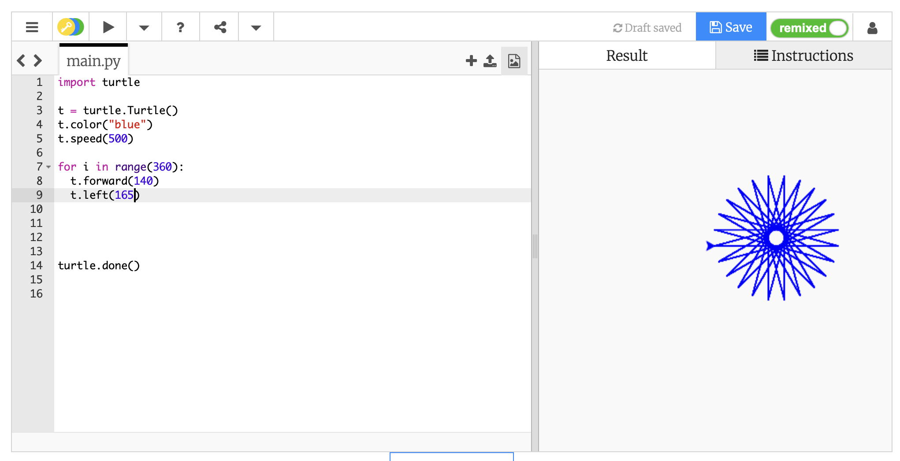

# Primi passi con Python e Turtle

`Turtle` è un modulo di Python che permette di disegnare dando comandi a una "tartaruga" virtuale.

La tartaruga:

- ha una posizione
- ha una direzione verso cui guarda
- può avanzare
- può ruotare
- può disegnare mentre si muove

Per programmare in Python e Turtle, utilizzeremo [Trinket](https://trinket.io/turtle)

